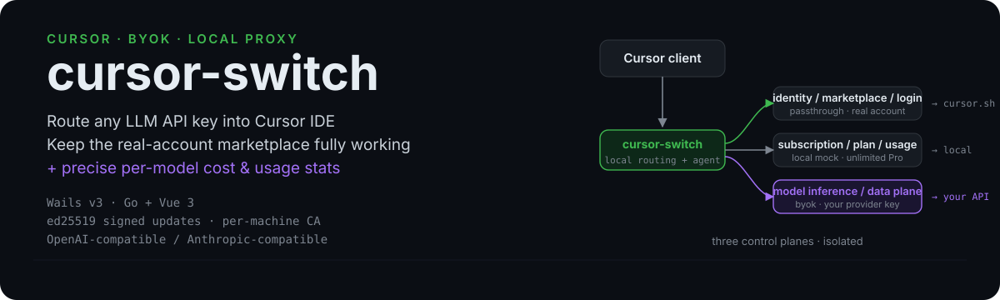
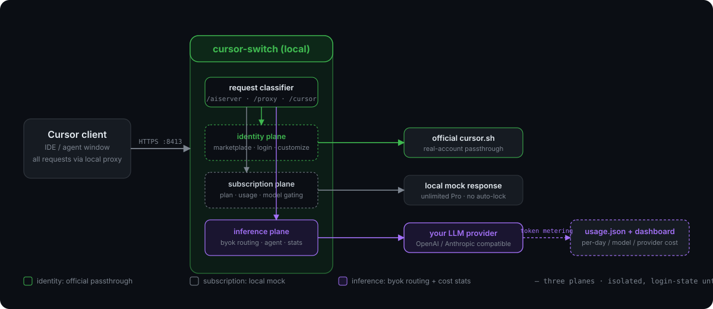

<div align="center">



[](LICENSE)
[](https://github.com/kael-odin/cursor-switch/releases)
[](https://github.com/kael-odin/cursor-switch/actions)
[](#-installation--usage)

📚 English · [中文](./README.md) · [API & architecture reference](./docs/接口与架构速查.md) · [Refactor notes](./docs/架构重构记录.md) · [Release & signing](./docs/RELEASE_SIGNING.md) · [Extra params/headers config](./docs/额外参数与自定义请求头配置.md)

</div>

> **Cursor BYOK** · **Cursor custom models** · **Cursor local proxy** · **Cursor third-party API** · **Cursor with your own key** · **Cursor cost tracking** · **Cursor agent self-hosting**
>
> Keywords: Cursor byok / Cursor custom LLM / OpenAI-compatible into Cursor / Anthropic Claude into Cursor / Cursor model routing / Cursor prompt cache / Cursor agent local / Cursor marketplace with real account

---

## 🚀 Why this fork

This is an enhanced fork of [leookun/cursor-byok](https://github.com/leookun/cursor-byok). On top of the upstream, it adds an **architecture-level refactor + a full cost & usage stats stack**, fixing several hard problems of the original:

| Pain point | Upstream original | This fork |
|---|---|---|
| Can you log into your real Cursor account while byok is on? | Fakes an Ultra account overwriting real login state — **can't log in/out** | Three control planes separated — **real account coexists with byok**, full login/logout/marketplace |
| marketplace / customize | Mocked fake data — **visible but not installable** (404) | Official passthrough — **extensions/MCP/skills/subagents/rules/commands/hooks all work** |
| Fetch model list | Hand-type modelID | **One-click provider `/v1/models` + multi-select batch add + context window auto-backfill** |
| Model pricing match | None | **Candidate matching** (strip namespace/version/date/reasoning-effort suffix) + **FRESH/TOTAL/legacy cost semantics** (no double-billing on cached parts) |
| Usage & cost visualization | Basic token counts | **ECharts usage dashboard**: daily trend / by-model / by-provider + real consumed tokens + cache hit rate + cost estimate |
| Default token params | 65536 output / fixed compaction reserve | **128K output** (aligns with Opus 5 / 4.8 flagship ceiling) + **dynamic compaction reserve** (8% of channel context window, adaptive) |
| Routing reliability | Single channel — main channel failure breaks the request | **Multi-provider candidate chain + circuit-breaker failover** (primary→backup auto-switch, never switches mid-output, breaker backstops) |
| Update safety | checksum | **gpt-5.6 full security audit, 35/37 closed**: ed25519 enforced signing + per-machine independent CA + loopback trust separation + SSRF protection + workspace write-path fence + stream resource budgets |

> Full architecture & route classification in [docs/接口与架构速查.md](./docs/接口与架构速查.md); refactor decision history in [docs/架构重构记录.md](./docs/架构重构记录.md).

---

## ✨ 1.0.0 Architecture refactor: real account + byok custom models coexist

Core change: **your real Cursor account and byok custom models coexist**.

### Problems in the old version (≤0.0.41)

- Faked an Ultra account written into Cursor's real local database, **overwriting your real login state** — you couldn't log in/out of your own Cursor account while byok was running
- marketplace / customize were mocked fake data — **visible but not installable** (cards showed but install 404'd)
- Fake Ultra identity mixed with the real account, causing inconsistent UI state

### Solution: three control planes separated

Cursor's requests are split into three non-interfering planes:

| Control plane | Handling | Result |
|---|---|---|
| **Identity / marketplace / login** | Official passthrough (real Cursor account) | login/logout/marketplace browse/install/uninstall/customize all work |
| **Subscription / plan / usage** | Local mock (unlimited Pro) | Model selector **not locked to auto**, not constrained by the real plan |
| **Model inference / data plane** | byok local (your provider key) | Custom model routing + cost stats |

<div align="center">



</div>

**Effect**: with byok on, you can use your own key/models, still use the real Cursor account's full marketplace, and log in/out normally.

### Security enhancements

- **Per-machine independent CA**: no more shared CA private key shipped with the binary; each machine gets its own CA on first launch
- **Enforced update signing**: `update.json` is ed25519-verified; a leaked release token still can't forge an accepted update
- **Loopback trust separation**: internal trust goes through a private header `X-Cursor-BYOK-Relay-Proof`, no longer hijacking `Authorization`; real Cursor credentials only return to original `*.cursor.sh`, never sent to a third-party provider
- **Write-path fence**: LLM file writes are restricted to workspace and terminal dirs, refusing sensitive paths like `~/.ssh`

### Tab-completion traffic destination (configurable)

Tab code completion / Git commit / branch-name generation (`StreamCpp` / `CppConfig` / `WriteGitCommitMessage`, etc.) defaults to the official `api2.cursor.sh` upstream — i.e. **uses your own Cursor account quota**, never silently routed to a third party.

Historically 1.0.x hardcoded this traffic to the author's shared pool `tab.leokun.cn`; from 1.1.1 it's configurable:

- **Config page → Tab-completion server URL**: empty = official Cursor upstream (default, most transparent); fill in your self-hosted `cursor-tab-server` URL to source from your own account
- The traffic destination is visible in the UI — no more third-party private domain hardcoded in the binary

---

## 🛡️ 2.0.0 Security & routing hardening

2.0.0 is the consolidation release after 1.1.0: completes the gpt-5.6 full static security audit, folds in production-grade routing, and closes out billing-correctness and performance work. Full audit evidence in [docs/AUDIT_2026-07-26.md](./docs/AUDIT_2026-07-26.md); release changes in [release-notes.md](./release-notes.md).

### gpt-5.6 full security audit (37 findings, 35 closed)

By fix surface: SSRF protection + provider redirect no-follow + conversation path-traversal; workspace write-path fence (realpath dual `EvalSymlinks`) + subagent readonly capability; stream resource budgets (bytes/events/64KiB-per-entry/cert-cache TTL); config field-level patch transaction + multiplier NaN/Inf validation; CA load validation + 0600/0700 file-perm migration; release-chain ed25519 pre-verification + manifest size limits + version alignment; lifecycle explicit state machine + directional stage-failure rollback + crash-consistency. Not closed: F-15 (local MITM client auth, needs architecture decision), F-07/F-01/F-09/F-17 (deferred policy).

### Production-grade routing (multi-provider candidate chain + circuit breaker)

When the same modelID has multiple adapters, a primary→backup candidate chain is built by priority; if the primary fails before producing output (connection error / 5xx / 429 / stream timeout), it auto-switches to the next — never mid-output to avoid double-sends. Circuit breaker: a provider with repeated failures or high error rate trips and backs off to the end of the chain.

### Cost & usage precision close-out

`EventIndex` persisted independently so 500-entry truncation no longer affects turn billing; `GetThoughtAnnotation` reverse index removes full-scan blowup; `realTotalTokens` corrected by `InputTokenSemantics`; `model_pricing_candidates` 7-segment matching + built-in pricing table synced to v3.18.0.

---

## 🌐 2.0.7 Web tool enhancements (free, zero-deploy, all users benefit)

2.0.7 closes the two web-tool items from [docs/AUDIT_2026-07-29_独立全量审查.md](./docs/AUDIT_2026-07-29_独立全量审查.md) ("behavior-deviation-3") — all free, zero-deploy, no config needed to start.

### WebSearch multi-provider SDK + DuckDuckGo JSON lite endpoint + keyless chain fallback

- **Multi-provider BYOK**: WebSearch no longer hardcodes DuckDuckGo HTML scraping. Pick Bing / Serper / Tavily in the "Web Tools" config card, enter the API key, and it goes through each provider's official HTTPS JSON (your own key = BYOK, far better quality/timeliness than HTML scraping). Bing with a key uses the official API v7; without a key it drops to keyless HTML scraping.
- **Keyless chain fallback (free tier)**: the selected keyless provider is the "chain head"; on failure or no results it tries the remaining keyless engines in a fixed order and the first engine returning non-empty results wins. Head duckduckgo → fallback order duckduckgo → bing → baidu; head baidu = Chinese-first (baidu→DDG→bing), head bing = mixed (bing→DDG→baidu), which also rescues mainland users whose DuckDuckGo is unreachable. All engines failing yields an aggregate error, never a silent empty.
- **No silent failure on missing key**: if you pick a key-required provider (serper/tavily) but leave the key empty, the tool result explicitly warns "API key required" instead of silently returning empty.
- **DuckDuckGo JSON lite (default, free)**: with no provider configured, WebSearch first tries the DuckDuckGo **Instant Answer JSON endpoint** (`api.duckduckgo.com/?format=json`, official, structured, no reliance on brittle HTML classes — **more stable**); on empty results it falls back to the original HTML scrape, so coverage never drops.

### WebFetch body LRU cache + intranet host allowlist

- **Body LRU cache**: repeated WebFetch of the same URL within 10 min (model re-fetching one page across reasoning steps, or concurrent streams hitting the same doc) is served from an in-process cache (4 MiB cap + 10 min TTL), skipping the network request + readability parse — lower latency, lower ban risk. The URL is normalized to a key (strip fragment / default port / sort query) so different spellings hit the same entry. Failures are not cached.
- **Intranet host allowlist**: WebFetch by default hard-rejects all non-public IPs (SSRF safety baseline). You can now add a host allowlist in the config card to explicitly allow enterprise intranet Wiki/Confluence; empty list = safest (reject all intranet). The allowlist is an explicit overlay on top of the hardcoded baseline — it never weakens default protection.

### Per-route official passthrough switch (@codebase / @docs / Repository Index)

Real vector retrieval for @codebase / @docs / Repository Index depends on the Cursor cloud index, which pure-local BYOK cannot replicate. Instead, the "per-route override" card now exposes an official passthrough switch for the `file_sync` (Codebase/Repository) and `network_service` (@docs) planes: switch to "direct Cursor" to use your own Cursor account's real index via upstream passthrough; keep "local" = stubbed registration (**a security feature that blocks code upload to third-party providers, not a defect**). Default stays all-local.

### Audit P0/P1 closure

2.0.7 also closes the independent audit's P0/P1 items: AwaitShell regex leak + unbounded buffer (P0-1/2), half-open permit leak freezing channels (P0-3), state.vscdb concurrent-write race (P0-4), F-20 over-aggressive truncation (P1-2), RequestKnobs shared-map pollution (P1-3), non-sliding circuit-breaker error rate (P1-4), EventIndex prune dropping turn billing (P1-5), Config route-mode Select not persisting (P1-7), optimistic-update rollback diverging from disk (P1-8), prefix-cache cross-day invalidation (behavior-deviation-1), cost square-weight (P2-1), EChart missing ResizeObserver (P2-7), background polling not pausing (P2-8), dead-code cleanup (P3-1). Per-item ✅ markers + fix history are in audit doc section 9.

---

## 📖 What this is

A desktop app (Wails v3 + Go backend + Vue 3 frontend) that runs a Cursor-compatible agent service locally and forwards Cursor client's chat / agent requests to **your own configured model provider**. It's not a Cursor replacement — it's a local man-in-the-middle proxy + a local agent execution core.

Use cases:
- Drive Cursor's chat & agent with a third-party OpenAI-compatible / Anthropic-compatible API
- Use your real Cursor account's marketplace / customize while running models on your own key
- Self-host the entire agent service, not locked into a single platform
- Accurately track token consumption and cost per model, per request

## 🔧 How it works

1. **Local service**: starts an HTTP/Connect-RPC service exposing Cursor-compatible endpoints
2. **Traffic import**: injects proxy settings into Cursor + installs a local CA cert, routing Cursor traffic to localhost
3. **Request routing**:
   - **Model / data-plane requests** → local backend compiles prompts, projects history, handles tool calls, then calls your configured provider
   - **Identity / marketplace / login requests** → passed through to Cursor's official backend (carrying your real login state)
   - **Subscription / plan requests** → locally mocked as unlimited, so the real plan doesn't lock the model
4. **Agent core**: a Cursor-like agent execution loop rebuilt locally (tool calls, shell, file edits, codebase indexing, context compaction, usage stats, session replay)

## 🤖 Supported model providers

| Type | Protocol | Examples |
|---|---|---|
| OpenAI-compatible | `/v1/responses`, `/v1/chat/completions`, custom paths | OpenAI official, various third-party OpenAI-compatible gateways |
| Anthropic-compatible | Anthropic Messages API | Claude official, Bedrock/Vertex passthrough, etc. |

Built-in **120+ model pricing table** (Anthropic Claude / OpenAI GPT / Google Gemini / xAI Grok / DeepSeek / Kimi / Doubao / Qwen / GLM / MiniMax / MiMo / Mistral / Cohere, etc.), covering 2026 flagship models (Claude Opus 5 / 4.8, GPT-5.6, Gemini 3.x, Grok 4.5, etc.).

Each model config includes: `baseURL`, `apiKey`, `modelID`, provider type, endpoint, reasoning effort, thinking budget, custom headers, extra request params, context window, max tokens, cost multiplier.

## 💻 Supported IDEs

- **Cursor** (current version; the code hardcodes Cursor's `state.vscdb` path, extension proto, and settings keys)

## ✅ Main features

### Model configuration
- **One-click fetch model list**: calls provider `/v1/models` from baseURL/apiKey, auto-detects candidate endpoints (OpenAI `/v1/models` ↔ Anthropic-compatible suffix stripping)
- **Multi-select batch add**: check several models and append at once, inheriting the current form's base URL / key / endpoint / custom params
- **Context window auto-backfill**: built-in models.dev cache table + candidate matching; fetched models auto-look-up context window (1M / 400K / 256K / 200K, etc.), no manual typing
- **Model adapter management**: GUI CRUD, single test / batch concurrent test (concurrency 10)

### Cost & usage stats
- **Usage dashboard**: ECharts daily trend (four-token stacked area + cost line, dual axis), by-model table, by-provider table, request log (latest 500)
- **Real consumed tokens**: fresh_input + output + cache_creation + cache_read (cc-switch convention)
- **Candidate-matched pricing**: strips namespace (`openai.`/`anthropic.`), `-vN` version, date suffix, reasoning-effort suffix (`-low/-medium/-high`), with prefix fallback — so `openai.gpt-5` / `claude-opus-4-6-20251114` both hit the price table
- **FRESH/TOTAL/legacy cost semantics**: OpenAI-family input already excludes the cached part (no double-billing), Anthropic family uses the legacy convention; the three-way billing difference is auto-calibrated
- **Per-adapter cost multiplier**: each model can have its own multiplier (1 = official price); a global default multiplier can override
- **Cache hit rate**: default convention / including cache-creation, switchable

### Agent core
- **Real account coexistence**: since 1.0.0, byok-on still lets you log in/out of your real Cursor account; marketplace/customize fully functional
- **Two run modes**: local service mode (default; requests go through the local backend to your configured model) / direct-Cursor mode (pass through to official, off by default)
- **prompt cache**: Anthropic cache breakpoints, OpenAI prompt_cache_key
- **thinking / reasoning**: deep thinking, reasoning effort control, provider-differentiated disable-field injection
- **Dynamic compaction reserve**: adaptive to channel context window (8%, min 16K / max 80K), no longer a fixed 10000
- **128K default max output**: aligns with Claude Opus 5 / 4.8 / Sonnet 5 flagship output ceilings
- **WebSearch multi-provider**: Bing / Serper / Tavily BYOK + DuckDuckGo JSON lite endpoint as free fallback; missing key warns explicitly
- **WebFetch body cache + host allowlist**: 10-min LRU for same URL; intranet host allowlist for enterprise Wiki/Confluence (default SSRF hard-reject baseline preserved)
- **Session persistence**: config / history / logs under `~/.cursor-local-assistant-v2/`

### Platform & security
- **Auto-update**: pulls an ed25519-signed `update.json` manifest from this repo's releases
- **Multilingual GUI**: Simplified Chinese, English, Japanese
- **Cross-platform**: Windows / macOS / Linux

---

## 🚀 Installation & usage

### Quick start

1. Download the package for your platform from [Releases](https://github.com/kael-odin/cursor-switch/releases)
2. Extract to any directory and launch
3. In "Model Config", add your model adapter (fill baseURL / apiKey / modelID, or click "Fetch model list" for one-click pull)
4. Start the local service (first run needs UAC elevation to install the CA cert)
5. **Log into your Cursor account** (a 1.0.0 capability: logging in works while byok is on)
6. **Then start Cursor** — order matters: plugin first, CA installed, model configured, account logged in, Cursor last

### Correct startup order

> Wrong order is the most common "it doesn't work" cause.

```
1. Start the cursor-switch plugin
2. First launch requests UAC to install the local CA cert → approve
3. Add your provider in "Model Config" (click "Fetch model list" for one-click pull + multi-select batch add) → test connectivity
4. Start the local service (toggle to "start")
5. Log into your Cursor account (in the plugin or in Cursor; no conflict since 1.0.0)
6. Start Cursor → open chat, pick your byok model → open marketplace to verify the full UI
```

### Model selector locked to auto?

If the chat UI is locked to auto and you can't pick a byok model, **check that you're on 1.0.0+**. Old versions lock auto due to the fake-account/real-account conflict; 1.0.0 fixes this by uniformly mocking subscription/usage as unlimited Pro.

### Cursor IDE self-update

Cursor's own version updates and the plugin **cannot run at the same time**: with the plugin on, Cursor's update check fails or gets intercepted by the proxy. Correct flow:

1. Close the cursor-switch plugin (stop the local service)
2. Open Cursor, check for and install updates
3. After the update, restart the plugin and continue

### Upgrading from an old version (≤0.0.41)

1.0.0's first launch **auto-cleans legacy fake-account injection**: when it detects the fake Ultra fingerprint written by old versions, it safely deletes fields still equal to the fake value (it never touches real values); after cleanup you need to **log in to your Cursor account once more**.

---

## 🛠️ Build

Dependencies: Go ≥1.25, Node.js, yarn, wails3 CLI (`v3.0.0-alpha.74`), protoc toolchain.

```bash
# Generate proto code (first time, or after proto changes)
wails3 task common:generate:proto

# Build the Windows amd64 release package (output: bin/windows-64.zip)
wails3 task build:windows:amd64
```

Quick pure-Go backend build (for dev self-test):

```bash
GOOS=windows CGO_ENABLED=0 GOARCH=amd64 go build -tags production -trimpath \
  -ldflags="-w -s -H windowsgui -X cursor/internal/buildinfo.Version=2.0.1" \
  -o "bin/CursorAssistant.exe" .
```

## 📦 Release

Multi-platform releases are built automatically by GitHub Actions (`.github/workflows/release.yml`). **See [docs/RELEASE_SIGNING.md](./docs/RELEASE_SIGNING.md) for prerequisites and the signing flow.**

Summary:

1. Sync the version number in three places: `build/config.yml` (`info.version`), `build/windows/info.json` (`file_version`/`ProductVersion`), `build/windows/wails.exe.manifest` (`version`)
2. Update `release-notes.md` with this release's changes
3. Commit and push to `main`
4. Tag to trigger: `git tag v1.0.0 && git push origin v1.0.0`
5. **Locally re-sign `update.json` after release** (the signing private key lives with the maintainer, not in CI):

```bash
gh release download v1.0.0 --pattern update.json --dir /tmp/
go run ./scripts/release sign --manifest /tmp/update.json
gh release upload v1.0.0 /tmp/update.json --clobber
```

Version strings containing `beta` / `rc` are auto-marked as prerelease.

---

## 📁 Project structure

```
internal/
  relayauth/             process-level relay proof (MITM→backend trust header)
  mitm/                  local MITM proxy (credential capture, proof injection)
  backend/
    server/              HTTP routes, middleware, credential capture, policy
    server/upstream/     outbound credential policy (CredentialOriginalCursor, etc.)
    server/config/       loopback enforcement, routing mode, pricing table + candidate matching
    forwarder/           agent execution core (actor/compaction/tool/usage_store)
    agent/model/         model adapters (openai.go / anthropic.go / router.go)
    host.go              routing classification table (passthrough vs local mock)
  cursor/                Cursor client injection (certs, settings, state.vscdb repair)
  netproxy/              system-level network proxy (with no-redirect client)
  updater/               auto-update + ed25519 signature verification
  certs/                 per-machine independent CA generation
  client/                fetch-models + context window backfill
  bridge/                usage dashboard backend + cost calc (FRESH/TOTAL/legacy)
  buildinfo/             version & release targets
frontend/                Vue 3 + vue-router + Tailwind + i18n + ECharts
proto/                   Cursor-compatible proto definitions
cursor-tab-server/       Cursor Tab completion reverse proxy (separate program)
docs/                    docs (architecture ref / refactor notes / release signing / dev guide)
```

## 📚 Documentation

- [接口与架构速查](./docs/接口与架构速查.md) — full route classification, credential chain, debugging
- [架构重构记录](./docs/架构重构记录.md) — 1.0.0 three-control-plane decision & pitfall history
- [发版与签名 RELEASE_SIGNING](./docs/RELEASE_SIGNING.md) — release prerequisites, ed25519 signing, old CA handling
- [开发指南 DEVELOPMENT](./docs/DEVELOPMENT.md) — dev loop, proto/bindings regen, test paradigms
- [新模型上线 SOP](./docs/NEW_MODEL_SOP.md) — how to add pricing + context window when a new model launches
- [Independent full audit 2026-07-29](./docs/AUDIT_2026-07-29_独立全量审查.md) — P0/P1/P2/P3 per-item ✅ markers + fix history

## 🤝 Contributing

Before a PR, run `go vet ./...` + `go test ./...`, and make sure the version number is synced in three places (CI `check.yml` enforces this).

When new models launch, just add a pricing record to `pricingModelSeed` in `internal/backend/server/config/pricing.go` and a context-window entry to `contextWindowByModelID` in `internal/client/model_context_window.go` — both tables are pure data.

## 📄 License

MIT. This project is derived from [leookun/cursor-byok](https://github.com/leookun/cursor-byok); thanks to the original author.
